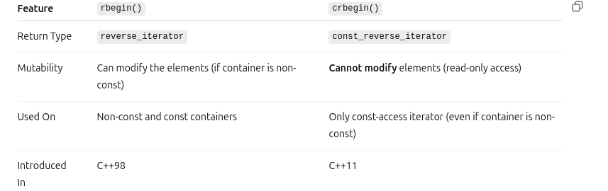
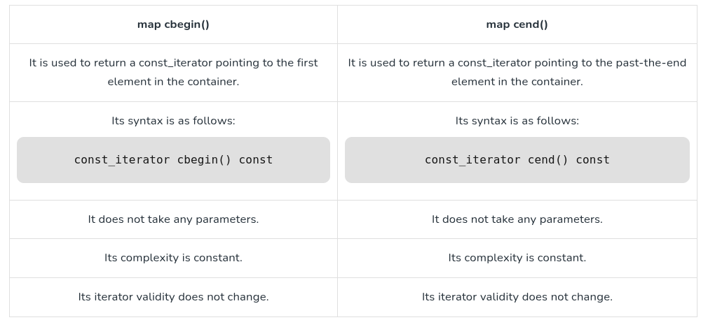

```rbgin() vs crbegin()```
``` #include <iostream>
#include <vector>

int main() {
    std::vector<int> nums = {1, 2, 3, 4};

    // rbegin() allows modification
    auto rit = nums.rbegin();
    *rit = 100;  // OK

    // crbegin() gives const_reverse_iterator
    auto crit = nums.crbegin();
    // *crit = 200; // ❌ Error: Cannot assign to const_iterator

    std::cout << "Modified with rbegin(): ";
    for (auto it = nums.crbegin(); it != nums.crend(); ++it) {
        std::cout << *it << " ";
    }
}
```


``` cbegin() vs cend()```

